# Hasil Dari Insert

- Nama : M.Fahmi Kurniawan
- NIM : 225150600111014

1.Insert Nilai Fakultas : 
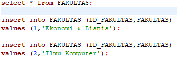
Hasil : 
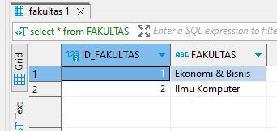

2.Insert Nilai Jurusan :
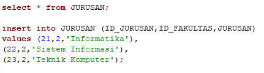
Hasil :
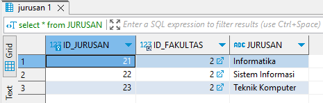

3.Insert Nilai Strata :
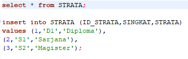
Hasil :
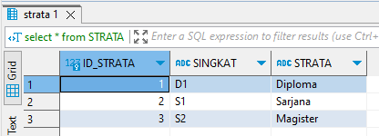

4.Insert Nilai Program Studi :
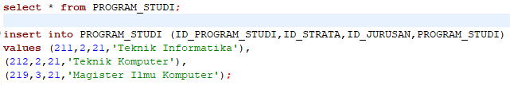
Hasil :
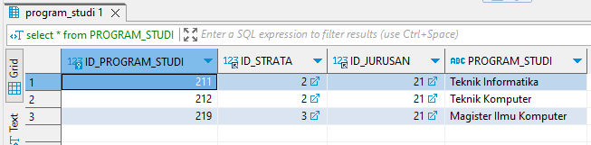

5.Insert Nilai Seleksi Masuk, dan Modifikasi Panjang Strata Menjadi Varchar(60) :
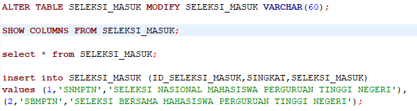
Hasil :
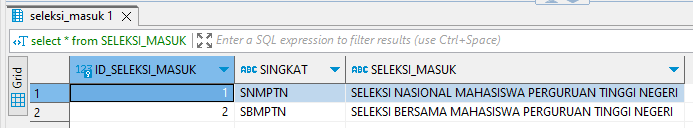

6.Insert Nilai Mahasiswa, dan Modifikasi Method chek Jenis_Kelamin :
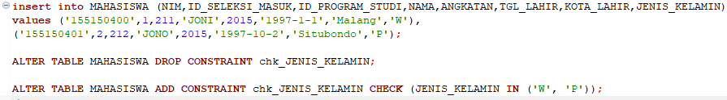
Hasil :
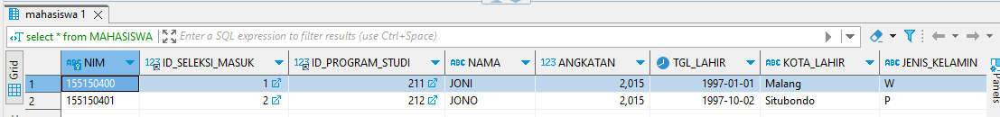
