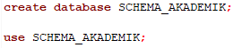
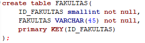
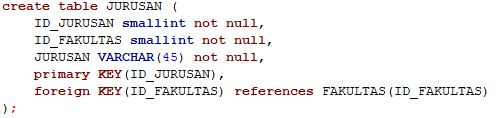
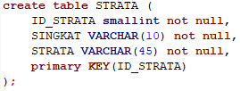
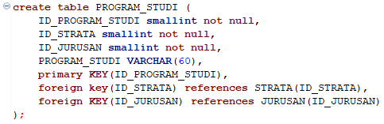
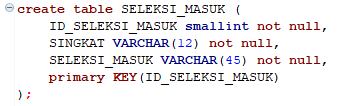
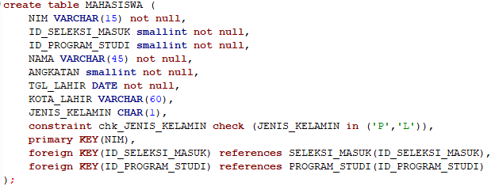
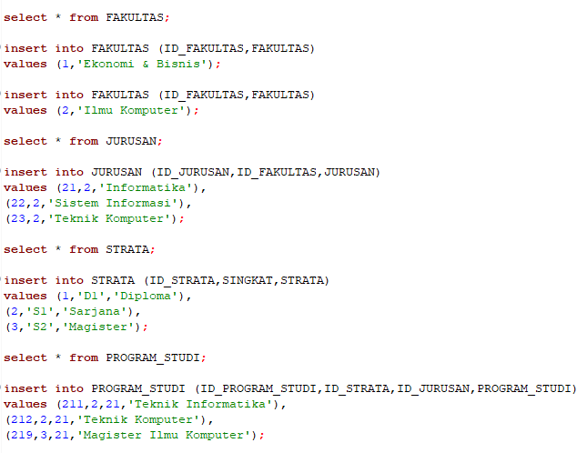
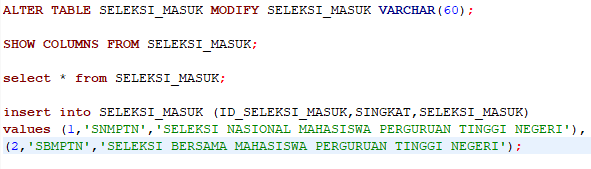
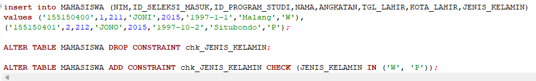

# Langkah-Langkah Pengerjaan Tugas 3 DBDSQL

- Nama : M.Fahmi Kurniawan
- NIM  : 225150600111014
 

1.Membuat DataBase dengan nama Schema_Akademik

2.Melakukan use DataBase yang akan digunakan untuk membuat table dan agar bisa melakukan insert value dalam table yang sudah dibuat untuk sintaks nya sama seperti gambar diatas.

3.Langkah selanjutnya saya membuat table - table dari gambar Desain ERD yang dikirim di Google Chat,didalam DataBase yang sudah di buat. Tabel yang pertama saya buat adalah table Fakultas, karena table tidak memiliki FK(Foreign Key), karena kita harus membuat table dari yang belum ada foreign key nya agar tidak eror ketika di run.

4.Langkah selanjuntya saya membuat table Jurusan, saya membuat table ini karena table jurusan memiliki FK dari table Fakultas yang sudah dibuat sebelumnya. sehingga ketika dirun table jurusan tidak eror.karena references table FKnya sudah dibuat.

5.Langkah ke 5 saya membuat table Strata, karena nantinya table Strata dan Jurusan akan Digunakan Untuk references table Program_Studi.

6.Membuat table Program_Studi Yang memiliki FK yang mereferences table Strata dan Jurusan.

7.Langkah ke7 saya membuat table Seleksi Masuk Karena Nantinya table yang akan dibuat dilangkah ke8 yaitu table Mahasiswa akan Mereferences table Seleksi_Masuk dan Progran_Studi.

8.Membuat table Mahasiswa Yang memiliki FK yang mereferences table Seleksi_Masuk dan Program_Studi.

9.Dilangkah ke9 ini saya memulai memasukan nilai/data pada kolom table-table yang sudah dibuat. sebelum saya memasukan nilai saya juga melakukan pengecekan table, apakah table yang saya buat sudah benar, lalu baru saya masukan nilainya/datanya, dan saya cek lagi apakah data atau nilai sudah terisi pada kolom yang sesuai. berikut sintaks pengecekan dan sintak menginputkan data pada table Fakultas,Jurusan,Dan Program_Studi.

10.Dilangkah sepuluh ini saya melakukan ALTER Table Seleksi Masuk karena kolom Seleksi_Masuk yang awalnya Varchar(45), tidak cukup untuk dimasukan Nilai/Data yang disuruh untuk dimasukan. Oleh karena itu saya melakukan ALTER table untuk mengganti batas kolom Seleksi_Masuk menjadi Varchar(60) agar cukup, dan saya juga melakukan perintah pengecekan table apakah sudah berubah batas Varcharnya, setelah itu saya baru memasukan Nilai yang disuruh ke table sesuai dengan cara saya, saat memasukan nilai ditable-table sebelumnya.

11.Langkah Ke11 atau langkah terakhir ini, saya memasukan nilai untuk kolom-kolom table Mahasiswa, namun disini saya juga melakukan kesalahan, karena pada table saya melakukan pengecekan jenis kelamin menggunakan huruf P dan L, padahal data yang dimasukan adalah huruf P dan W, karena hal tersebut menyebabkan eror ketika saya memasukan nilai tersebut, jadi saya terpaksa meng Alter table Mahasiswa untuk menghapus sintaks pengecekan jenis kelamin, lalu saya melakukan Alter lagi untuk memasukan sintaks pengecekan Jenis Kelamin Di table mahasiswa dengan Huruf P dan W sesuai dengan data yang dimasukan. dan setelah itu baru saya masukan lagi nilainya sesuai dengan yang diperintahkan.

